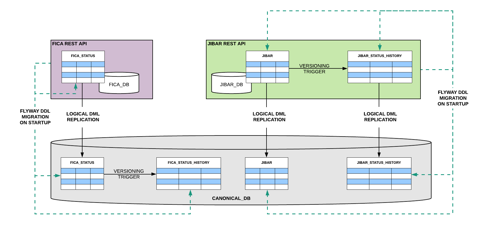

# Deployment Demo for Micro-Services & Logical DB Replication with Temporal Tables

This demo uses docker-compose to illustrate a deployment environment including:  
- 2 restful micro-service's each with their own DB instance, which use [Flyway](https://flywaydb.org/) to version their schemas
- a CANONICAL_DB
- all setup with Logical Replication and the temporal history tables with versioning triggers.
- 1 of these micro-services leaves all auditing concerns to the Canonical DB, thus does not have a `_history` table on its own DB
- the other micro-service does have its own `_history` table, and has both the source and _history table replicated to Canonical DB



# Pre-requisites
- [docker](https://www.docker.com)
- [docker-compose](https://docs.docker.com/compose/)
- [curl](https://github.com/curl/curl) (a handy command line client to do HTTP requests) 
- [jq](https://stedolan.github.io/jq/) (a nice command line JSON processor)

# Steps
From the `deployment-demo` folder, spin up the environment using (:warning: **Warning**: the 1st time you run this it may take some time):
```bash
docker-compose up --build -d
```

**Next: :hourglass_flowing_sand: wait a little**, whilst each of the containers within the environment start up

Check if each of the API's are up by running: 
```bash
curl localhost:8181/actuator/health | jq '.'
curl localhost:8182/actuator/health | jq '.'
```
ensure that you get a valid up status (from both) as below before continuing
```JSON
{
  "status": "UP"
}
```

Test out the GET methods for the API's: 
```bash
curl localhost:8181/fica/v1 | jq '.'
curl localhost:8182/jibar-rates | jq '.'
```
You should see an array of JSON objects in both cases.

:notebook: Take note that the version 2 url for FICA API is not found yet  (404), we will create that below 
```bash
curl localhost:8181/fica/v2 | jq '.'
```

# Let's take a look at the FICA micro-service first.
- this micro-service leaves the auditing up to the CANONICAL_DB
- thus only creates it's own tables with no `_history`, no versioning function or trigger on the `_fica.fica_status` table all of this is done on the CANONICAL_DB

Describing the `_fica.fica_status` table on FICA_DB is as follows: 
```bash
postgres=# \c fica_db 
You are now connected to database "fica_db" as user "postgres".
fica_db=# \d _fica.fica_status
                                          Table "_fica.fica_status"
   Column   |   Type    | Collation | Nullable |                           Default                            
------------+-----------+-----------+----------+--------------------------------------------------------------
 id         | integer   |           | not null | nextval('_fica.fica_status_id_seq'::regclass)
 name       | text      |           | not null | 
 status     | text      |           | not null | 
 changed_by | text      |           | not null | 
 sys_period | tstzrange |           | not null | tstzrange(CURRENT_TIMESTAMP, NULL::timestamp with time zone)
Indexes:
    "fica_status_pkey" PRIMARY KEY, btree (id)
Publications:
    "fica_db"

fica_db=# 
```
Where as describing the `_fica.fica_status` table on CANONICAL_DB is as follows:
<pre><code>
postgres=# \c canonical_db 
You are now connected to database "canonical_db" as user "postgres".
canonical_db=# \d _fica.fica_status
                                          Table "_fica.fica_status"
   Column   |   Type    | Collation | Nullable |                           Default                            
------------+-----------+-----------+----------+--------------------------------------------------------------
 id         | integer   |           | not null | nextval('_fica.fica_status_id_seq'::regclass)
 name       | text      |           | not null | 
 status     | text      |           | not null | 
 changed_by | text      |           | not null | 
 sys_period | tstzrange |           | not null | tstzrange(CURRENT_TIMESTAMP, NULL::timestamp with time zone)
Indexes:
    "fica_status_pkey" PRIMARY KEY, btree (id)
<b>Triggers firing always:
    versioning_trigger BEFORE INSERT OR DELETE OR UPDATE ON _fica.fica_status FOR EACH ROW EXECUTE PROCEDURE _flyway.versioning('sys_period', '_fica.fica_status_history', 'true')</b>

canonical_db=# 
</code></pre>

## The next couple steps will take you through using the FICA API 
- to make changes to the `_fica.fica_status` table
- simulate a version upgrade which adds a column to the DB and runs a data fix

Query the CANONICAL_DB tables (**NOTICE:** we have rows in the `_fica.fica_status` table, and nothing in `_fica.fica_status_history` table yet.)
```bash
./query_canonical_fica_db.sh
```
We should have something like this:
```SQL
Querying the '_fica.fica_status' table on CANONICAL_DB
 id |   name    |    status     | changed_by |             sys_period             
----+-----------+---------------+------------+------------------------------------
  1 | mr big    | non-compliant | vanessa    | ["2019-10-02 22:27:56.139297+00",)
  2 | mr cool   | frozen        | tracy      | ["2019-10-02 22:27:56.139297+00",)
  3 | mr frugal | compliant     | betty      | ["2019-10-02 22:27:56.139297+00",)
(3 rows)

Querying the '_fica.fica_status_history' table on CANONICAL_DB
 id | name | status | changed_by | sys_period 
----+------+--------+------------+------------
(0 rows)
```

Use the API to add a new fica-status record: 
```bash
curl -X POST localhost:8181/fica/v1 -H "Content-type:application/json" -d "{\"name\":\"miss thrifty\",\"status\":\"non-compliant\",\"changedBy\":\"rest api call\"}" | jq '.'
```
Query the CANONICAL_DB again (This time *NOTICE:* we have a new row (id 4) in the fica_status table, and nothing in fica_status_history table yet.)
```bash
./query_canonical_fica_db.sh
```
We should have something like this:
<pre><code>
Querying the '_fica.fica_status' table on CANONICAL_DB
 id |     name     |    status     |  changed_by   |             sys_period             
----+--------------+---------------+---------------+------------------------------------
  1 | mr big       | non-compliant | vanessa       | ["2019-10-02 22:27:56.139297+00",)
  2 | mr cool      | frozen        | tracy         | ["2019-10-02 22:27:56.139297+00",)
  3 | mr frugal    | compliant     | betty         | ["2019-10-02 22:27:56.139297+00",)
<b>  4 | miss thrifty | non-compliant | rest api call | ["2019-10-02 22:40:19.505845+00",)</b>
(4 rows)

Querying the '_fica.fica_status_history' table on CANONICAL_DB
 id | name | status | changed_by | sys_period 
----+------+--------+------------+------------
(0 rows)
</code></pre>
Use the API to update the fica-status of record 4: 
```bash
curl -X PUT localhost:8181/fica/v1/4 -H "Content-type:application/json" -d "{\"name\":\"miss thrifty\",\"status\":\"compliant\",\"changedBy\":\"rest api call2\"}" | jq '.'
```
Query the CANONICAL_DB again (This time *NOTICE:* fica_status (id 4) is now compliant, and change_by updated, we also have a record of this change in the history.)
```bash
./query_canonical_fica_db.sh
```
We should have something like this:
<pre><code>
Querying the '_fica.fica_status' table on CANONICAL_DB
 id |     name     |    status     |   changed_by   |             sys_period             
----+--------------+---------------+----------------+------------------------------------
  1 | mr big       | non-compliant | vanessa        | ["2019-10-02 22:27:56.139297+00",)
  2 | mr cool      | frozen        | tracy          | ["2019-10-02 22:27:56.139297+00",)
  3 | mr frugal    | compliant     | betty          | ["2019-10-02 22:27:56.139297+00",)
  4 | miss thrifty | <b>compliant</b>     | rest api call2 | ["2019-10-02 22:41:10.981027+00",)
(4 rows)

Querying the '_fica.fica_status_history' table on CANONICAL_DB
 id |     name     |    status     |  changed_by   |                            sys_period                             
----+--------------+---------------+---------------+-------------------------------------------------------------------
  <b>4 | miss thrifty | non-compliant | rest api call | ["2019-10-02 22:40:19.505845+00","2019-10-02 22:41:10.981027+00")</b>
(1 row)
</code></pre>

# Now we simulate a new version deployment for the FICA API which will
Add a title column for the fica_status table, run a data-fix to split the current data in name column so that title is in its own column. 
We already written scripts to do this change, they are in the folder `/docker-compose/fica-ms/db/sql/upgrade_example` .. 
Move these scripts into the correct location by running
```bash
./write_flyway_migration_scripts_4_fica_version2.sh
```
"Deploy" new version of the API (and run its flyway migration scripts to its DB and CANONICAL_DB):
```bash
docker-compose up --build -d
```
Query the CANONICAL_DB again 
  - This time *NOTICE:* we have a new column title on both fica_status and fica_status_history
  - the data in fica_status has been updated to split out title from name column
  - and fica_status_history has recorded that each of the names used to include title, and title was default value assigned to fica_status column when adding the column via ALTER table
```bash
./query_canonical_fica_db.sh
```
We should have something like this:
<pre><code>
Querying the '_fica.fica_status' table on CANONICAL_DB
 id |  name   |    status     |              changed_by               |             sys_period             | title 
----+---------+---------------+---------------------------------------+------------------------------------+-------
  1 | <b>big</b>     | non-compliant | data fix D2__split_name_and_title.sql | ["2019-10-02 22:45:30.886587+00",) | <b>mr</b>
  2 | <b>cool</b>    | frozen        | data fix D2__split_name_and_title.sql | ["2019-10-02 22:45:30.886587+00",) | <b>mr</b>
  3 | <b>frugal</b>  | compliant     | data fix D2__split_name_and_title.sql | ["2019-10-02 22:45:30.886587+00",) | <b>mr</b>
  4 | <b>thrifty</b> | compliant     | data fix D2__split_name_and_title.sql | ["2019-10-02 22:45:30.886587+00",) | <b>miss</b>
(4 rows)

Querying the '_fica.fica_status_history' table on CANONICAL_DB
 id |     name     |    status     |   changed_by   |                            sys_period                             |          title           
----+--------------+---------------+----------------+-------------------------------------------------------------------+--------------------------
  4 | miss thrifty | non-compliant | rest api call  | ["2019-10-02 22:40:19.505845+00","2019-10-02 22:41:10.981027+00") | needs changing (from C3)
<b>  1 | mr big       | non-compliant | vanessa        | ["2019-10-02 22:27:56.139297+00","2019-10-02 22:45:30.886587+00") | needs changing (from V3)
  2 | mr cool      | frozen        | tracy          | ["2019-10-02 22:27:56.139297+00","2019-10-02 22:45:30.886587+00") | needs changing (from V3)
  3 | mr frugal    | compliant     | betty          | ["2019-10-02 22:27:56.139297+00","2019-10-02 22:45:30.886587+00") | needs changing (from V3)
  4 | miss thrifty | compliant     | rest api call2 | ["2019-10-02 22:41:10.981027+00","2019-10-02 22:45:30.886587+00") | needs changing (from V3)
</b>  
(5 rows)
</pre></code>

# We can now use version2 of the API 
to run through similar steps and see the audit tables functioning as expected

Call the API to see all fica-status data: 
```bash
curl localhost:8181/fica/v2 | jq '.'
```
Notice: in the response you are now seeing the title field
```JSON
[
  {
    "id": 1,
    "title": "mr",
    "name": "big",
    "status": "non-compliant",
    "changedBy": "data fix D2__split_name_and_title.sql"
  },
  {
    "id": 2,
    "title": "mr",
    "name": "cool",
    "status": "frozen",
    "changedBy": "data fix D2__split_name_and_title.sql"
  },
  {
    "id": 3,
    "title": "mr",
    "name": "frugal",
    "status": "compliant",
    "changedBy": "data fix D2__split_name_and_title.sql"
  },
  {
    "id": 4,
    "title": "miss",
    "name": "thrifty",
    "status": "compliant",
    "changedBy": "data fix D2__split_name_and_title.sql"
  }
]
```

Use the API to add a new fica-status record: 
```bash
curl -X POST localhost:8181/fica/v2 -H "Content-type:application/json" -d "{\"title\":\"mrs\",\"name\":\"economical\",\"status\":\"non-compliant\",\"changedBy\":\"rest api call\"}" | jq '.'
```
Query the CANONICAL_DB again (This time *NOTICE:* we have a new row (id 4) in the fica_status table, and nothing in fica_status_history table yet.)
```bash
./query_canonical_fica_db.sh
```
We should have something like this:
```SQL
Querying the '_fica.fica_status' table on CANONICAL_DB
 id |    name    |    status     |              changed_by               |             sys_period             | title 
----+------------+---------------+---------------------------------------+------------------------------------+-------
  1 | big        | non-compliant | data fix D2__split_name_and_title.sql | ["2019-10-02 22:45:30.886587+00",) | mr
  2 | cool       | frozen        | data fix D2__split_name_and_title.sql | ["2019-10-02 22:45:30.886587+00",) | mr
  3 | frugal     | compliant     | data fix D2__split_name_and_title.sql | ["2019-10-02 22:45:30.886587+00",) | mr
  4 | thrifty    | compliant     | data fix D2__split_name_and_title.sql | ["2019-10-02 22:45:30.886587+00",) | miss
  5 | economical | non-compliant | rest api call                         | ["2019-10-02 22:48:33.927057+00",) | mrs
(5 rows)

Querying the '_fica.fica_status_history' table on CANONICAL_DB
 id |     name     |    status     |   changed_by   |                            sys_period                             |          title           
----+--------------+---------------+----------------+-------------------------------------------------------------------+--------------------------
  4 | miss thrifty | non-compliant | rest api call  | ["2019-10-02 22:40:19.505845+00","2019-10-02 22:41:10.981027+00") | needs changing (from C3)
  1 | mr big       | non-compliant | vanessa        | ["2019-10-02 22:27:56.139297+00","2019-10-02 22:45:30.886587+00") | needs changing (from V3)
  2 | mr cool      | frozen        | tracy          | ["2019-10-02 22:27:56.139297+00","2019-10-02 22:45:30.886587+00") | needs changing (from V3)
  3 | mr frugal    | compliant     | betty          | ["2019-10-02 22:27:56.139297+00","2019-10-02 22:45:30.886587+00") | needs changing (from V3)
  4 | miss thrifty | compliant     | rest api call2 | ["2019-10-02 22:41:10.981027+00","2019-10-02 22:45:30.886587+00") | needs changing (from V3)
(5 rows)
```

Use the API to update the fica-status of record 4: 
```bash
curl -X PUT localhost:8181/fica/v2/5 -H "Content-type:application/json" -d "{\"title\":\"dr\",\"name\":\"economical\",\"status\":\"compliant\",\"changedBy\":\"rest api call2\"}" | jq '.'
```
Query the CANONICAL_DB again (This time *NOTICE:* fica_status (id 4) is now compliant, and change_by updated, we also have a record of this change in the history.)
```bash
./query_canonical_fica_db.sh
```
We should have something like this:
<pre><code>
Querying the '_fica.fica_status' table on CANONICAL_DB
 id |    name    |    status     |              changed_by               |             sys_period             | title 
----+------------+---------------+---------------------------------------+------------------------------------+-------
  1 | big        | non-compliant | data fix D2__split_name_and_title.sql | ["2019-10-02 22:45:30.886587+00",) | mr
  2 | cool       | frozen        | data fix D2__split_name_and_title.sql | ["2019-10-02 22:45:30.886587+00",) | mr
  3 | frugal     | compliant     | data fix D2__split_name_and_title.sql | ["2019-10-02 22:45:30.886587+00",) | mr
  4 | thrifty    | compliant     | data fix D2__split_name_and_title.sql | ["2019-10-02 22:45:30.886587+00",) | miss
  5 | economical | compliant     | rest api call2                        | ["2019-10-02 22:49:54.024032+00",) | dr
(5 rows)

Querying the '_fica.fica_status_history' table on CANONICAL_DB
 id |     name     |    status     |   changed_by   |                            sys_period                             |          title           
----+--------------+---------------+----------------+-------------------------------------------------------------------+--------------------------
  4 | miss thrifty | non-compliant | rest api call  | ["2019-10-02 22:40:19.505845+00","2019-10-02 22:41:10.981027+00") | needs changing (from C3)
  1 | mr big       | non-compliant | vanessa        | ["2019-10-02 22:27:56.139297+00","2019-10-02 22:45:30.886587+00") | needs changing (from V3)
  2 | mr cool      | frozen        | tracy          | ["2019-10-02 22:27:56.139297+00","2019-10-02 22:45:30.886587+00") | needs changing (from V3)
  3 | mr frugal    | compliant     | betty          | ["2019-10-02 22:27:56.139297+00","2019-10-02 22:45:30.886587+00") | needs changing (from V3)
  4 | miss thrifty | compliant     | rest api call2 | ["2019-10-02 22:41:10.981027+00","2019-10-02 22:45:30.886587+00") | needs changing (from V3)
  <b>5 | economical   | non-compliant | rest api call  | ["2019-10-02 22:48:33.927057+00","2019-10-02 22:49:54.024032+00") | mrs</b>
(6 rows)
</pre></code>

For good measure you can run deletes via the API to check audit of delete is in place
```bash
curl -X DELETE localhost:8181/fica/v1/4
curl -X DELETE localhost:8181/fica/v2/5
```
Query the CANONICAL_DB again (This time *NOTICE:* fica_status (id 4) is now compliant, and change_by updated, we also have a record of this change in the history.)
```bash
./query_canonical_fica_db.sh
```
We should have something like this:
<pre><code>
Querying the '_fica.fica_status' table on CANONICAL_DB
 id |  name  |    status     |              changed_by               |             sys_period             | title 
----+--------+---------------+---------------------------------------+------------------------------------+-------
  1 | big    | non-compliant | data fix D2__split_name_and_title.sql | ["2019-10-02 22:45:30.886587+00",) | mr
  2 | cool   | frozen        | data fix D2__split_name_and_title.sql | ["2019-10-02 22:45:30.886587+00",) | mr
  3 | frugal | compliant     | data fix D2__split_name_and_title.sql | ["2019-10-02 22:45:30.886587+00",) | mr
(3 rows)

failed to resize tty, using default size
Querying the '_fica.fica_status_history' table on CANONICAL_DB
 id |     name     |    status     |              changed_by               |                            sys_period                             |          title           
----+--------------+---------------+---------------------------------------+-------------------------------------------------------------------+--------------------------
  4 | miss thrifty | non-compliant | rest api call                         | ["2019-10-02 22:40:19.505845+00","2019-10-02 22:41:10.981027+00") | needs changing (from C3)
  1 | mr big       | non-compliant | vanessa                               | ["2019-10-02 22:27:56.139297+00","2019-10-02 22:45:30.886587+00") | needs changing (from V3)
  2 | mr cool      | frozen        | tracy                                 | ["2019-10-02 22:27:56.139297+00","2019-10-02 22:45:30.886587+00") | needs changing (from V3)
  3 | mr frugal    | compliant     | betty                                 | ["2019-10-02 22:27:56.139297+00","2019-10-02 22:45:30.886587+00") | needs changing (from V3)
  4 | miss thrifty | compliant     | rest api call2                        | ["2019-10-02 22:41:10.981027+00","2019-10-02 22:45:30.886587+00") | needs changing (from V3)
  5 | economical   | non-compliant | rest api call                         | ["2019-10-02 22:48:33.927057+00","2019-10-02 22:49:54.024032+00") | mrs
  <b>4 | thrifty      | compliant     | data fix D2__split_name_and_title.sql | ["2019-10-02 22:45:30.886587+00","2019-10-02 22:50:54.950424+00") | miss
  5 | economical   | compliant     | rest api call2                        | ["2019-10-02 22:49:54.024032+00","2019-10-02 22:51:00.467208+00") | dr  </b>
(8 rows) 
</pre></code>

# Let's take a look at the JIBAR micro-service next.
- this micro-service includes the auditing in its own JIBAR_DB
- and uses logical replication to CANONICAL_DB of both the `_jibar.jibar` table and `_jibar.jibar_history` table
The main difference now is that the trigger is ENABLED on the micro-service DB and DISABLED at the CANONICAL_DB

Describing the `_jibar.jibar` table on JIBAR_DB is as follows: 
<pre><code>
postgres=# \c jibar_db
You are now connected to database "jibar_db" as user "postgres".
jibar_db=# \d _jibar.jibar
                                                    Table "_jibar.jibar"
   Column   |           Type           | Collation | Nullable |                           Default                            
------------+--------------------------+-----------+----------+--------------------------------------------------------------
 id         | integer                  |           | not null | nextval('_jibar.jibar_id_seq'::regclass)
 rate       | text                     |           | not null | 
 valid_from | timestamp with time zone |           |          | 
 updated_by | text                     |           | not null | 
 sys_period | tstzrange                |           | not null | tstzrange(CURRENT_TIMESTAMP, NULL::timestamp with time zone)
Indexes:
    "jibar_pkey" PRIMARY KEY, btree (id)
Publications:
    "jibar_db"
<b>Triggers firing always:
    versioning_trigger BEFORE INSERT OR DELETE OR UPDATE ON _jibar.jibar FOR EACH ROW EXECUTE PROCEDURE _flyway.versioning('sys_period', '_jibar.jibar_history', 'true')</b>

jibar_db=# 
</pre></code>
and then describing the `_jibar.jibar` table on CANONICAL_DB is as follows:
<pre><code>
canonical_db=# \d _jibar.jibar
                                                    Table "_jibar.jibar"
   Column   |           Type           | Collation | Nullable |                           Default                            
------------+--------------------------+-----------+----------+--------------------------------------------------------------
 id         | integer                  |           | not null | nextval('_jibar.jibar_id_seq'::regclass)
 rate       | text                     |           | not null | 
 valid_from | timestamp with time zone |           |          | 
 updated_by | text                     |           | not null | 
 sys_period | tstzrange                |           | not null | tstzrange(CURRENT_TIMESTAMP, NULL::timestamp with time zone)
Indexes:
    "jibar_pkey" PRIMARY KEY, btree (id)
<b>Disabled user triggers:
    versioning_trigger BEFORE INSERT OR DELETE OR UPDATE ON _jibar.jibar FOR EACH ROW EXECUTE PROCEDURE _flyway.versioning('sys_period', '_jibar.jibar_history', 'true')</b>

canonical_db=# 
</pre></code>

You can query the jibar related tables on both the JIBAR_DB and CANONICAL_DB using the script
```bash
./query_jibar_dbs.sh
```

To simulate the rate change data fix and deployment use
```bash
./write_flyway_datafix_scripts_for_jibar.sh
```

And query the jibar related tables on both the JIBAR_DB and CANONICAL_DB again, to see the effect using the script
```bash
./query_jibar_dbs.sh
```

# Lastly stop and run the clean up scripts to put this demo back in its original state
```bash
./stop-cleanup-demo.sh
```

You can also use docker compose command (there will be some files used in above demo out of place)
```bash
docker-compose down --remove-orphans
```

# How the Flyway scripts are structured for these micro-services
During deployment we run multiple different Flway migrations as some are needed only of the micro-service and others only on the canonical (and visa versa)
- We use the `_flyway` schema to hold versioning tables for each of the migration sets and micro-services (when on the CANONICAL_DB)
- Migrations run include: schema changes, data fixes, setup of publications (and also setup of subscribers as well as creating the versioning function and table triggers)

Thus within the _flyway schema on the different DBs we get something like
```bash
fica_db=# \dt _flyway.*
                    List of relations
 Schema  |            Name            | Type  |  Owner   
---------+----------------------------+-------+----------
 _flyway | fica_data_versions         | table | postgres
 _flyway | fica_publications_versions | table | postgres
 _flyway | fica_schema_versions       | table | postgres
(3 rows)

fica_db=# 
```

```bash
jibar_db=# \dt _flyway.*
                    List of relations
 Schema  |            Name             | Type  |  Owner   
---------+-----------------------------+-------+----------
 _flyway | jibar_data_versions         | table | postgres
 _flyway | jibar_publications_versions | table | postgres
 _flyway | jibar_schema_versions       | table | postgres
(3 rows)

jibar_db=#
```

And on the Canonical DB, this: 

```bash
canonical_db=# \dt _flyway.*
                  List of relations
 Schema  |          Name           | Type  |  Owner   
---------+-------------------------+-------+----------
 _flyway | fica_canonial_versions  | table | postgres
 _flyway | fica_schema_versions    | table | postgres
 _flyway | jibar_canonial_versions | table | postgres
 _flyway | jibar_schema_versions   | table | postgres
(4 rows)

canonical_db=#
```

## Using a naming convention such that:

- anything that must run on the CANONICAL_DB under `/canonical` folder and prefixed with `C`
- schema changes which will be applied to both the microservice and CANONICAL_DB under `/ms` folder and prefixed with `V`
- publications which will only be applied to the microservice db (as we don't want CANONICAL_DB publishing data out) under `/ms` folder and prefixed with `P`
- data fixes which will only be applied to the microservice db (as they'll be replicated to CANONICAL_DB) under `/ms` folder and prefixed with `D`
- [Flyway Callbacks](https://flywaydb.org/documentation/callbacks) are used 
  - to create the temporal `versioning` function (i.e.: beforeMigrate__versioning_function.sql in the structure below)
  - to refresh any subscriptions on the canonical db (i.e.: afterMigrate__refresh_subscription.sql in the structure below) this is to cater for when: `new tables are added to the publication, you also need to “refresh” the subscription on the destination side (canonical db) to tell Postgres to start syncing the new tables`

## The migrations sets are run in the following order:

1) Schema changes to the ms DB
2) Publication of tables on ms DB
    - publications cannot be part of schema changes (V__) as they must only exist on ms DB 
    - neither can the be a callback within ms folder, as V__ scripts are run to both ms & canonical
    - and they can't be part of data (D__'s) as we want to setup publications before any data is written to ms DB, so the data is in fact published
    - although we could include publications with data scripts (D__'s), it would require specifically ordering data before publications correctly (keeping them seprate is easier in this regard)
3) Schema changes to the canonical DB
4) Adding and/or Refreshing Subscriptions on the canonical DB
    -- Postgres subscriptions don't automatically sync new tables added to a publication. Therefore we call `REFRESH subscription` on canonical side with callback `afterMigrate__refresh_subscription.sql` after every migration
5) data changes to ms DB 

**FICA API**
```bash
.
├── canonical
│   ├── afterMigrate__refresh_subscription.sql
│   ├── beforeMigrate__versioning_function.sql
│   ├── C1__create_subscription.sql
│   └── C2__history-tables.sql
└── ms
    ├── D1__db-fica.sql
    ├── P1__create_publication.sql
    └── V1__db-fica.sql
```

**JIBAR API**
```bash
.
├── canonical
│   ├── afterMigrate__refresh_subscription.sql
│   ├── C1__create_subscription.sql
│   └── C2__disable_jibar_trigger.sql
└── ms
    ├── beforeMigrate__versioning_function.sql
    ├── D1__db-jibar.sql
    ├── P1__create_publication.sql
    ├── V1__db-jibar.sql
    └── V2__jibar-history-tables.sql
```

# More use cases, to test logical replication & the `_history` tables are working as expected
[Adding a table to publication, micro-service with multiple schemas](bank-ms/README.md)

## Types of DB changes tested so far: 
- column change's with data fix (to source, destination and _history tables)
- adding new tables, and in turn adding these to the existing publication

# References
- https://www.onwerk.de/2019/06/07/automatic-database-schema-upgrading-in-dockerized-projects/
- https://pgdash.io/blog/postgres-replication-gotchas.html
- https://www.sars.gov.za/TaxTypes/TT/How-Submit/Annual-Return/Pages/Universal-Branch-Codes.aspx

# TODOs
1) **TODO** Is it an issue that sequence values are not replicated to destination? https://pgdash.io/blog/postgres-replication-gotchas.html (see Sequences section)
    - :thinking: current thinking: is that this is not a problem as data never inserted on canonical 
    - for backup & then restore's a step for brining the sequence values up-to-date is better placed
  
2) **TODO** Should we migrate destination first, then source? 
    - :thinking: Why should we be checking this, replication will always continue correctly even if destination is not up-to-date (logical replication will correctly sort this out) 
    - _HOWEVER::_ when looking at the `temporal_tables`:  if a column is added to the original table but not to the history table 
    `The new column will be ignored, meaning that the updated row is transferred to the history table, but without the value of the new column. This means that you will lose that specific data.`
    - if the ms's continue to run whilst migration is taking:
      - there is a slight chance of data lost in audit tables for this extra column (in the time between source and then history table being updated) 
      - i.e.: it will only be audited from the point when adding to _history
    
  
  
