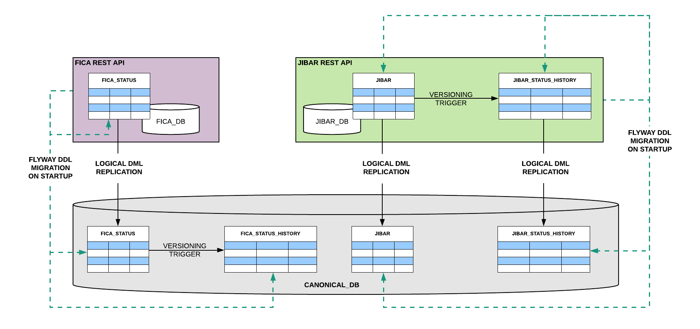

# Docker Compose example for the Temporal Journey in practice 

This examples includes:  
- 2 restful micro-service's each with their own DB instance, which use [Flyway](https://flywaydb.org/) to version their schemas
- a CANONICAL_DB
- all setup with Logical Replication and the temporal history tables with versioning triggers. 



# Pre-requisites
- [docker](https://www.docker.com)
- [docker-compose](https://docs.docker.com/compose/)
- [curl](https://github.com/curl/curl) (a handy command line client to do HTTP requests) 
- [jq](https://stedolan.github.io/jq/) (a nice command line JSON processor)

# Steps
From the `docker-compose` folder, spin up the environment using (:warning: **Warning**: the 1st time you run this it may take some time):
```bash
docker-compose up --build -d
```

**Next: :hourglass_flowing_sand: wait a little**, whilst each of the containers within the environment start up

Check if each of the API's are up by running: 
```bash
curl localhost:8181/actuator/health | jq '.'
curl localhost:8182/actuator/health | jq '.'
```
ensure that you get a valid up status (from both) as below before continuing
```JSON
{
  "status": "UP"
}
```

Test out the GET methods for the API's: 
```bash
curl localhost:8181/fica/v1 | jq '.'
curl localhost:8182/jibar-rates | jq '.'
```
You should see an array of JSON objects in both cases.

:notebook: Take note that the version 2 url for FICA API is not found yet  (404), we will create that below `curl localhost:8181/fica/v1 | jq '.'`

# Let's take a look at the FICA micro-service first.
- this micro-service leaves the auditing up to the CANONICAL_DB
- thus only creates it's own tables with no `_history`, no versioning function or trigger on the `_fica.fica_status` table all of this is done on the CANONICAL_DB

Describing the `_fica.fica_status` table on FICA_DB is as follows: 
```bash
postgres=# \c fica_db 
You are now connected to database "fica_db" as user "postgres".
fica_db=# \d _fica.fica_status
                                          Table "_fica.fica_status"
   Column   |   Type    | Collation | Nullable |                           Default                            
------------+-----------+-----------+----------+--------------------------------------------------------------
 id         | integer   |           | not null | nextval('_fica.fica_status_id_seq'::regclass)
 name       | text      |           | not null | 
 status     | text      |           | not null | 
 changed_by | text      |           | not null | 
 sys_period | tstzrange |           | not null | tstzrange(CURRENT_TIMESTAMP, NULL::timestamp with time zone)
Indexes:
    "fica_status_pkey" PRIMARY KEY, btree (id)
Publications:
    "fica_db"

fica_db=# 
```
Where as describing the `_fica.fica_status` table on CANONICAL_DB is as follows:
```bash
postgres=# \c canonical_db 
You are now connected to database "canonical_db" as user "postgres".
canonical_db=# \d _fica.fica_status
                                          Table "_fica.fica_status"
   Column   |   Type    | Collation | Nullable |                           Default                            
------------+-----------+-----------+----------+--------------------------------------------------------------
 id         | integer   |           | not null | nextval('_fica.fica_status_id_seq'::regclass)
 name       | text      |           | not null | 
 status     | text      |           | not null | 
 changed_by | text      |           | not null | 
 sys_period | tstzrange |           | not null | tstzrange(CURRENT_TIMESTAMP, NULL::timestamp with time zone)
Indexes:
    "fica_status_pkey" PRIMARY KEY, btree (id)
Triggers firing always:
    versioning_trigger BEFORE INSERT OR DELETE OR UPDATE ON _fica.fica_status FOR EACH ROW EXECUTE PROCEDURE _flyway.versioning('sys_period', '_fica.fica_status_history', 'true')

canonical_db=# 
```

## The next couple steps will take you through using the FICA API 
- to make changes to the `_fica.fica_status` table
- simulate a version upgrade which adds a column to the DB and runs a data fix

Query the CANONICAL_DB tables (**NOTICE:** we have rows in the `_fica.fica_status` table, and nothing in `_fica.fica_status_history` table yet.)
```bash
./query_canonical_fica_db.sh
```
We should have something like this:
```SQL
Querying the '_fica.fica_status' table on CANONICAL_DB
 id |   name    |    status     | changed_by |             sys_period             
----+-----------+---------------+------------+------------------------------------
  1 | mr big    | non-compliant | vanessa    | ["2019-10-02 22:27:56.139297+00",)
  2 | mr cool   | frozen        | tracy      | ["2019-10-02 22:27:56.139297+00",)
  3 | mr frugal | compliant     | betty      | ["2019-10-02 22:27:56.139297+00",)
(3 rows)

Querying the '_fica.fica_status_history' table on CANONICAL_DB
 id | name | status | changed_by | sys_period 
----+------+--------+------------+------------
(0 rows)
```

Use the API to add a new fica-status record: 
```bash
curl -X POST localhost:8181/fica/v1 -H "Content-type:application/json" -d "{\"name\":\"miss thrifty\",\"status\":\"non-compliant\",\"changedBy\":\"rest api call\"}" | jq '.'
```
Query the CANONICAL_DB again (This time *NOTICE:* we have a new row (id 4) in the fica_status table, and nothing in fica_status_history table yet.)
```bash
./query_canonical_fica_db.sh
```
We should have something like this:
```SQL
Querying the '_fica.fica_status' table on CANONICAL_DB
 id |     name     |    status     |  changed_by   |             sys_period             
----+--------------+---------------+---------------+------------------------------------
  1 | mr big       | non-compliant | vanessa       | ["2019-10-02 22:27:56.139297+00",)
  2 | mr cool      | frozen        | tracy         | ["2019-10-02 22:27:56.139297+00",)
  3 | mr frugal    | compliant     | betty         | ["2019-10-02 22:27:56.139297+00",)
  4 | miss thrifty | non-compliant | rest api call | ["2019-10-02 22:40:19.505845+00",)
(4 rows)

Querying the '_fica.fica_status_history' table on CANONICAL_DB
 id | name | status | changed_by | sys_period 
----+------+--------+------------+------------
(0 rows)
```
Use the API to update the fica-status of record 4: 
```bash
curl -X PUT localhost:8181/fica/v1/4 -H "Content-type:application/json" -d "{\"name\":\"miss thrifty\",\"status\":\"compliant\",\"changedBy\":\"rest api call2\"}" | jq '.'
```
Query the CANONICAL_DB again (This time *NOTICE:* fica_status (id 4) is now compliant, and change_by updated, we also have a record of this change in the history.)
```bash
./query_canonical_fica_db.sh
```
We should have something like this:
```SQL
Querying the '_fica.fica_status' table on CANONICAL_DB
 id |     name     |    status     |   changed_by   |             sys_period             
----+--------------+---------------+----------------+------------------------------------
  1 | mr big       | non-compliant | vanessa        | ["2019-10-02 22:27:56.139297+00",)
  2 | mr cool      | frozen        | tracy          | ["2019-10-02 22:27:56.139297+00",)
  3 | mr frugal    | compliant     | betty          | ["2019-10-02 22:27:56.139297+00",)
  4 | miss thrifty | compliant     | rest api call2 | ["2019-10-02 22:41:10.981027+00",)
(4 rows)

Querying the '_fica.fica_status_history' table on CANONICAL_DB
 id |     name     |    status     |  changed_by   |                            sys_period                             
----+--------------+---------------+---------------+-------------------------------------------------------------------
  4 | miss thrifty | non-compliant | rest api call | ["2019-10-02 22:40:19.505845+00","2019-10-02 22:41:10.981027+00")
(1 row)
```

# Now we simulate a new version deployment for the FICA API which will
Add a title column for the fica_status table, run a data-fix to split the current data in name column so that title is in its own column. 
We already written scripts to do this change, they are in the folder `/docker-compose/fica-ms/db/sql/upgrade_example` .. 
Move these scripts into the correct location by running
```bash
./write_flyway_migration_scripts_4_fica_version2.sh
```
"Deploy" new version of the API (and run its flyway migration scripts to its DB and CANONICAL_DB):
```bash
docker-compose up --build -d
```
Query the CANONICAL_DB again 
  - This time *NOTICE:* we have a new column title on both fica_status and fica_status_history
  - the data in fica_status has been updated to split out title from name column
  - and fica_status_history has recorded that each of the names used to include title, and title was default value assigned to fica_status column when adding the column via ALTER table
```bash
./query_canonical_fica_db.sh
```
We should have something like this:
```SQL
Querying the '_fica.fica_status' table on CANONICAL_DB
 id |  name   |    status     |              changed_by               |             sys_period             | title 
----+---------+---------------+---------------------------------------+------------------------------------+-------
  1 | big     | non-compliant | data fix D2__split_name_and_title.sql | ["2019-10-02 22:45:30.886587+00",) | mr
  2 | cool    | frozen        | data fix D2__split_name_and_title.sql | ["2019-10-02 22:45:30.886587+00",) | mr
  3 | frugal  | compliant     | data fix D2__split_name_and_title.sql | ["2019-10-02 22:45:30.886587+00",) | mr
  4 | thrifty | compliant     | data fix D2__split_name_and_title.sql | ["2019-10-02 22:45:30.886587+00",) | miss
(4 rows)

Querying the '_fica.fica_status_history' table on CANONICAL_DB
 id |     name     |    status     |   changed_by   |                            sys_period                             |          title           
----+--------------+---------------+----------------+-------------------------------------------------------------------+--------------------------
  4 | miss thrifty | non-compliant | rest api call  | ["2019-10-02 22:40:19.505845+00","2019-10-02 22:41:10.981027+00") | needs changing (from C3)
  1 | mr big       | non-compliant | vanessa        | ["2019-10-02 22:27:56.139297+00","2019-10-02 22:45:30.886587+00") | needs changing (from V3)
  2 | mr cool      | frozen        | tracy          | ["2019-10-02 22:27:56.139297+00","2019-10-02 22:45:30.886587+00") | needs changing (from V3)
  3 | mr frugal    | compliant     | betty          | ["2019-10-02 22:27:56.139297+00","2019-10-02 22:45:30.886587+00") | needs changing (from V3)
  4 | miss thrifty | compliant     | rest api call2 | ["2019-10-02 22:41:10.981027+00","2019-10-02 22:45:30.886587+00") | needs changing (from V3)
(5 rows)
```

# We can now use version2 of the API 
to run through similar steps and see the audit tables functioning as expected

Call the API to see all fica-status data: 
```bash
curl localhost:8181/fica/v2 | jq '.'
```
Notice: in the response you are now seeing the title field
```JSON
[
  {
    "id": 1,
    "title": "mr",
    "name": "big",
    "status": "non-compliant",
    "changedBy": "data fix D2__split_name_and_title.sql"
  },
  {
    "id": 2,
    "title": "mr",
    "name": "cool",
    "status": "frozen",
    "changedBy": "data fix D2__split_name_and_title.sql"
  },
  {
    "id": 3,
    "title": "mr",
    "name": "frugal",
    "status": "compliant",
    "changedBy": "data fix D2__split_name_and_title.sql"
  },
  {
    "id": 4,
    "title": "miss",
    "name": "thrifty",
    "status": "compliant",
    "changedBy": "data fix D2__split_name_and_title.sql"
  }
]
```

Use the API to add a new fica-status record: 
```bash
curl -X POST localhost:8181/fica/v2 -H "Content-type:application/json" -d "{\"title\":\"mrs\",\"name\":\"economical\",\"status\":\"non-compliant\",\"changedBy\":\"rest api call\"}" | jq '.'
```
Query the CANONICAL_DB again (This time *NOTICE:* we have a new row (id 4) in the fica_status table, and nothing in fica_status_history table yet.)
```bash
./query_canonical_fica_db.sh
```
We should have something like this:
```SQL
Querying the '_fica.fica_status' table on CANONICAL_DB
 id |    name    |    status     |              changed_by               |             sys_period             | title 
----+------------+---------------+---------------------------------------+------------------------------------+-------
  1 | big        | non-compliant | data fix D2__split_name_and_title.sql | ["2019-10-02 22:45:30.886587+00",) | mr
  2 | cool       | frozen        | data fix D2__split_name_and_title.sql | ["2019-10-02 22:45:30.886587+00",) | mr
  3 | frugal     | compliant     | data fix D2__split_name_and_title.sql | ["2019-10-02 22:45:30.886587+00",) | mr
  4 | thrifty    | compliant     | data fix D2__split_name_and_title.sql | ["2019-10-02 22:45:30.886587+00",) | miss
  5 | economical | non-compliant | rest api call                         | ["2019-10-02 22:48:33.927057+00",) | mrs
(5 rows)

Querying the '_fica.fica_status_history' table on CANONICAL_DB
 id |     name     |    status     |   changed_by   |                            sys_period                             |          title           
----+--------------+---------------+----------------+-------------------------------------------------------------------+--------------------------
  4 | miss thrifty | non-compliant | rest api call  | ["2019-10-02 22:40:19.505845+00","2019-10-02 22:41:10.981027+00") | needs changing (from C3)
  1 | mr big       | non-compliant | vanessa        | ["2019-10-02 22:27:56.139297+00","2019-10-02 22:45:30.886587+00") | needs changing (from V3)
  2 | mr cool      | frozen        | tracy          | ["2019-10-02 22:27:56.139297+00","2019-10-02 22:45:30.886587+00") | needs changing (from V3)
  3 | mr frugal    | compliant     | betty          | ["2019-10-02 22:27:56.139297+00","2019-10-02 22:45:30.886587+00") | needs changing (from V3)
  4 | miss thrifty | compliant     | rest api call2 | ["2019-10-02 22:41:10.981027+00","2019-10-02 22:45:30.886587+00") | needs changing (from V3)
(5 rows)
```

Use the API to update the fica-status of record 4: 
```bash
curl -X PUT localhost:8181/fica/v2/5 -H "Content-type:application/json" -d "{\"title\":\"dr\",\"name\":\"economical\",\"status\":\"compliant\",\"changedBy\":\"rest api call2\"}" | jq '.'
```
Query the CANONICAL_DB again (This time *NOTICE:* fica_status (id 4) is now compliant, and change_by updated, we also have a record of this change in the history.)
```bash
./query_canonical_fica_db.sh
```
We should have something like this:
```SQL
Querying the '_fica.fica_status' table on CANONICAL_DB
 id |    name    |    status     |              changed_by               |             sys_period             | title 
----+------------+---------------+---------------------------------------+------------------------------------+-------
  1 | big        | non-compliant | data fix D2__split_name_and_title.sql | ["2019-10-02 22:45:30.886587+00",) | mr
  2 | cool       | frozen        | data fix D2__split_name_and_title.sql | ["2019-10-02 22:45:30.886587+00",) | mr
  3 | frugal     | compliant     | data fix D2__split_name_and_title.sql | ["2019-10-02 22:45:30.886587+00",) | mr
  4 | thrifty    | compliant     | data fix D2__split_name_and_title.sql | ["2019-10-02 22:45:30.886587+00",) | miss
  5 | economical | compliant     | rest api call2                        | ["2019-10-02 22:49:54.024032+00",) | dr
(5 rows)

Querying the '_fica.fica_status_history' table on CANONICAL_DB
 id |     name     |    status     |   changed_by   |                            sys_period                             |          title           
----+--------------+---------------+----------------+-------------------------------------------------------------------+--------------------------
  4 | miss thrifty | non-compliant | rest api call  | ["2019-10-02 22:40:19.505845+00","2019-10-02 22:41:10.981027+00") | needs changing (from C3)
  1 | mr big       | non-compliant | vanessa        | ["2019-10-02 22:27:56.139297+00","2019-10-02 22:45:30.886587+00") | needs changing (from V3)
  2 | mr cool      | frozen        | tracy          | ["2019-10-02 22:27:56.139297+00","2019-10-02 22:45:30.886587+00") | needs changing (from V3)
  3 | mr frugal    | compliant     | betty          | ["2019-10-02 22:27:56.139297+00","2019-10-02 22:45:30.886587+00") | needs changing (from V3)
  4 | miss thrifty | compliant     | rest api call2 | ["2019-10-02 22:41:10.981027+00","2019-10-02 22:45:30.886587+00") | needs changing (from V3)
  5 | economical   | non-compliant | rest api call  | ["2019-10-02 22:48:33.927057+00","2019-10-02 22:49:54.024032+00") | mrs
(6 rows)
```

For good measure you can run deletes via the API to check audit of delete is in place
```bash
curl -X DELETE localhost:8181/fica/v1/4
curl -X DELETE localhost:8181/fica/v2/5
```
Query the CANONICAL_DB again (This time *NOTICE:* fica_status (id 4) is now compliant, and change_by updated, we also have a record of this change in the history.)
```bash
./query_canonical_fica_db.sh
```
We should have something like this:
```SQL
Querying the '_fica.fica_status' table on CANONICAL_DB
 id |  name  |    status     |              changed_by               |             sys_period             | title 
----+--------+---------------+---------------------------------------+------------------------------------+-------
  1 | big    | non-compliant | data fix D2__split_name_and_title.sql | ["2019-10-02 22:45:30.886587+00",) | mr
  2 | cool   | frozen        | data fix D2__split_name_and_title.sql | ["2019-10-02 22:45:30.886587+00",) | mr
  3 | frugal | compliant     | data fix D2__split_name_and_title.sql | ["2019-10-02 22:45:30.886587+00",) | mr
(3 rows)

failed to resize tty, using default size
Querying the '_fica.fica_status_history' table on CANONICAL_DB
 id |     name     |    status     |              changed_by               |                            sys_period                             |          title           
----+--------------+---------------+---------------------------------------+-------------------------------------------------------------------+--------------------------
  4 | miss thrifty | non-compliant | rest api call                         | ["2019-10-02 22:40:19.505845+00","2019-10-02 22:41:10.981027+00") | needs changing (from C3)
  1 | mr big       | non-compliant | vanessa                               | ["2019-10-02 22:27:56.139297+00","2019-10-02 22:45:30.886587+00") | needs changing (from V3)
  2 | mr cool      | frozen        | tracy                                 | ["2019-10-02 22:27:56.139297+00","2019-10-02 22:45:30.886587+00") | needs changing (from V3)
  3 | mr frugal    | compliant     | betty                                 | ["2019-10-02 22:27:56.139297+00","2019-10-02 22:45:30.886587+00") | needs changing (from V3)
  4 | miss thrifty | compliant     | rest api call2                        | ["2019-10-02 22:41:10.981027+00","2019-10-02 22:45:30.886587+00") | needs changing (from V3)
  5 | economical   | non-compliant | rest api call                         | ["2019-10-02 22:48:33.927057+00","2019-10-02 22:49:54.024032+00") | mrs
  4 | thrifty      | compliant     | data fix D2__split_name_and_title.sql | ["2019-10-02 22:45:30.886587+00","2019-10-02 22:50:54.950424+00") | miss
  5 | economical   | compliant     | rest api call2                        | ["2019-10-02 22:49:54.024032+00","2019-10-02 22:51:00.467208+00") | dr
(8 rows) 
```

# Let's take a look at the JIBAR micro-service next.
- this micro-service includes the auditing in its own JIBAR_DB
- and uses logical replication to CANONICAL_DB of both the `_jibar.jibar` table and `_jibar.jibar_history` table
The main difference now is that the trigger is ENABLED on the micro-service DB and DISABLED at the CANONICAL_DB

Describing the `_jibar.jibar` table on JIBAR_DB is as follows: 
```bash
postgres=# \c jibar_db
You are now connected to database "jibar_db" as user "postgres".
jibar_db=# \d _jibar.jibar
                                                    Table "_jibar.jibar"
   Column   |           Type           | Collation | Nullable |                           Default                            
------------+--------------------------+-----------+----------+--------------------------------------------------------------
 id         | integer                  |           | not null | nextval('_jibar.jibar_id_seq'::regclass)
 rate       | text                     |           | not null | 
 valid_from | timestamp with time zone |           |          | 
 updated_by | text                     |           | not null | 
 sys_period | tstzrange                |           | not null | tstzrange(CURRENT_TIMESTAMP, NULL::timestamp with time zone)
Indexes:
    "jibar_pkey" PRIMARY KEY, btree (id)
Publications:
    "jibar_db"
Triggers firing always:
    versioning_trigger BEFORE INSERT OR DELETE OR UPDATE ON _jibar.jibar FOR EACH ROW EXECUTE PROCEDURE _flyway.versioning('sys_period', '_jibar.jibar_history', 'true')

jibar_db=# 
```
and then describing the `_jibar.jibar` table on CANONICAL_DB is as follows:
```bash
canonical_db=# \d _jibar.jibar
                                                    Table "_jibar.jibar"
   Column   |           Type           | Collation | Nullable |                           Default                            
------------+--------------------------+-----------+----------+--------------------------------------------------------------
 id         | integer                  |           | not null | nextval('_jibar.jibar_id_seq'::regclass)
 rate       | text                     |           | not null | 
 valid_from | timestamp with time zone |           |          | 
 updated_by | text                     |           | not null | 
 sys_period | tstzrange                |           | not null | tstzrange(CURRENT_TIMESTAMP, NULL::timestamp with time zone)
Indexes:
    "jibar_pkey" PRIMARY KEY, btree (id)
Disabled user triggers:
    versioning_trigger BEFORE INSERT OR DELETE OR UPDATE ON _jibar.jibar FOR EACH ROW EXECUTE PROCEDURE _flyway.versioning('sys_period', '_jibar.jibar_history', 'true')

canonical_db=# 
```

You can query the jibar related tables on both the JIBAR_DB and CANONICAL_DB using the script
```bash
./query_jibar_dbs.sh
```

To simulate the rate change data fix and deployment use
```bash
./write_flyway_datafix_scripts_for_jibar.sh
```

And query the jibar related tables on both the JIBAR_DB and CANONICAL_DB again, to see the effect using the script
```bash
./query_jibar_dbs.sh
```

# Lastly stop and run the clean up scripts to put this demo back in its original state
```bash
./stop-cleanup-demo.sh
```

You can also use docker compose command (there will be some files used in above demo out of place)
```bash
docker-compose down --remove-orphans
```

# How the Flyway scripts are structured for these micro-services
During deployment we run multiple different Flway migrations as some are needed only of the micro-service and others only on the canonical (and visa versa)
- We use the `_flyway` schema to hold versioning tables for each of the migration sets and micro-services (when on the CANONICAL_DB)
- Migrations run include: schema changes, data fixes, setup of publications (and also setup of subscribers as well as creating the versioning function and table triggers)

Thus within the _flyway schema on the different DBs we get something like
```bash
fica_db=# \dt _flyway.*
                    List of relations
 Schema  |            Name            | Type  |  Owner   
---------+----------------------------+-------+----------
 _flyway | fica_data_versions         | table | postgres
 _flyway | fica_publications_versions | table | postgres
 _flyway | fica_schema_versions       | table | postgres
(3 rows)

fica_db=# 
```

```bash
jibar_db=# \dt _flyway.*
                    List of relations
 Schema  |            Name             | Type  |  Owner   
---------+-----------------------------+-------+----------
 _flyway | jibar_data_versions         | table | postgres
 _flyway | jibar_publications_versions | table | postgres
 _flyway | jibar_schema_versions       | table | postgres
(3 rows)

jibar_db=#
```

```bash
canonical_db=# \dt _flyway.*
                  List of relations
 Schema  |          Name           | Type  |  Owner   
---------+-------------------------+-------+----------
 _flyway | fica_canonial_versions  | table | postgres
 _flyway | fica_schema_versions    | table | postgres
 _flyway | jibar_canonial_versions | table | postgres
 _flyway | jibar_schema_versions   | table | postgres
(4 rows)

canonical_db=#
```

Using a naming convention for each of these:
 - anything that must run on the CANONICAL_DB under canonical folder and prefixed with C
 - schema changes which will be applied to both the microservice and CANONICAL_DB under ms folder and prefixed with V
 - data fixes which will only be applied to the microservice db (as they'll be replicated to CANONICAL_DB) under ms folder and prefixed with D
 - publications which will only be applied to the microservice db (as we don't want CANONICAL_DB publishing data out) under ms folder and prefixed with P 
 
**FICA API**
```bash
.
├── canonical
│   ├── beforeMigrate__versioning_function.sql
│   ├── C1__create_subscription.sql
│   └── C2__history-tables.sql
└── ms
    ├── D1__db-fica.sql
    ├── P1__create_publication.sql
    └── V1__db-fica.sql
```

**JIBAR API**
```bash
.
├── canonical
│   ├── C1__create_subscription.sql
│   └── C2__disable_jibar_trigger.sql
└── ms
    ├── beforeMigrate__versioning_function.sql
    ├── D1__db-jibar.sql
    ├── P1__create_publication.sql
    ├── V1__db-jibar.sql
    └── V2__jibar-history-tables.sql
```

We are running the Flyway steps in the following order:
```bash
flyway -configFiles=microservicedb.conf -table=fica_schema_versions -sqlMigrationPrefix=V migrate
flyway -configFiles=microservicedb.conf -table=fica_publications_versions -sqlMigrationPrefix=P migrate
                                         
flyway -configFiles=canonicaldb.conf    -table=fica_schema_versions -sqlMigrationPrefix=V -locations=filesystem:/sql/migrations/ms migrate
flyway -configFiles=canonicaldb.conf    -table=fica_canonial_versions -sqlMigrationPrefix=C -locations=filesystem:/sql/migrations/canonical migrate

flyway -configFiles=microservicedb.conf -table=fica_data_versions -sqlMigrationPrefix=D migrate
```

# References
- https://www.onwerk.de/2019/06/07/automatic-database-schema-upgrading-in-dockerized-projects/
- https://pgdash.io/blog/postgres-replication-gotchas.html

# TODOs
1) :question: *TODO* are separate scripts needed for publications (ie: prefix P) can they not just run as D scripts .. remember publication scripts must only run on ms level same as data
2) :question: *TODO* if columns are added to source & not dest, auditing continues however that column is not audited   (will only be audited from the point when adding to _history)
3) :question: *TODO* I don't see error `ERROR:  logical replication target relation "public.t" is missing some replicated columns` https://pgdash.io/blog/postgres-replication-gotchas.html  and logic used here is (changes to source 1st then dest) is opposite to their recommendation
4) :question: *TODO* should the sequences issue (their value not being replicated to dest) be sorted out? 

 
 
 