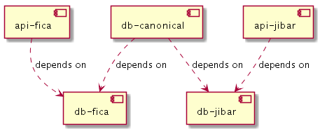

# Docker Compose example which includes
- a restful micro-service that uses [Flyway](https://flywaydb.org/) to migrate its DB 
- a canonical db
- all setup with logical replication and the temporal history tables and triggers. 



# Pre-requisites
This example uses:
- [docker](https://www.docker.com)
- [docker-compose](https://docs.docker.com/compose/)
- [curl](https://github.com/curl/curl) (a handy command line client to do HTTP requests) 
- [jq](https://stedolan.github.io/jq/) (a nice command line JSON processor)

# Steps
From the `docker-compose` folder, spin up the environment using:

*WARNING: the first time you run this is make take some time as dependencies are downloaded during build)*
```bash
docker-compose up --build -d
```
**Wait a little**, whilst each of the containers within the environment start up

Check if the API is up by running: 
```bash
curl localhost:8181/actuator/health | jq '.'
```
ensure that you get a valid up status as below before continuing
```JSON
{
  "status": "UP"
}
```

Call the API to see all fica-status data: 
```bash
curl localhost:8181/fica/v1 | jq '.'
```
We should have something like this:
```JSON
[
  {
    "id": 1,
    "name": "mr big",
    "status": "non-compliant",
    "changedBy": "vanessa"
  },
  {
    "id": 2,
    "name": "mr cool",
    "status": "frozen",
    "changedBy": "tracy"
  },
  {
    "id": 3,
    "name": "mr frugal",
    "status": "compliant",
    "changedBy": "betty"
  }
]
```

Query the canonical DB tables (**NOTICE:** we have rows in the fica_status table, and nothing in fica_status_history table yet.)
```bash
./query_canonical_db.sh
```
We should have something like this:
```SQL
Querying the '_fica.fica_status' table on canonical DB
 id |   name    |    status     | changed_by |             sys_period             
----+-----------+---------------+------------+------------------------------------
  1 | mr big    | non-compliant | vanessa    | ["2019-10-02 22:27:56.139297+00",)
  2 | mr cool   | frozen        | tracy      | ["2019-10-02 22:27:56.139297+00",)
  3 | mr frugal | compliant     | betty      | ["2019-10-02 22:27:56.139297+00",)
(3 rows)

Querying the '_fica.fica_status_history' table on canonical DB
 id | name | status | changed_by | sys_period 
----+------+--------+------------+------------
(0 rows)
```

Use the API to add a new fica-status record: 
```bash
curl -X POST localhost:8181/fica/v1 -H "Content-type:application/json" -d "{\"name\":\"miss thrifty\",\"status\":\"non-compliant\",\"changedBy\":\"rest api call\"}" | jq '.'
```
Query the canonical DB again (This time *NOTICE:* we have a new row (id 4) in the fica_status table, and nothing in fica_status_history table yet.)
```bash
./query_canonical_db.sh
```
We should have something like this:
```SQL
Querying the '_fica.fica_status' table on canonical DB
 id |     name     |    status     |  changed_by   |             sys_period             
----+--------------+---------------+---------------+------------------------------------
  1 | mr big       | non-compliant | vanessa       | ["2019-10-02 22:27:56.139297+00",)
  2 | mr cool      | frozen        | tracy         | ["2019-10-02 22:27:56.139297+00",)
  3 | mr frugal    | compliant     | betty         | ["2019-10-02 22:27:56.139297+00",)
  4 | miss thrifty | non-compliant | rest api call | ["2019-10-02 22:40:19.505845+00",)
(4 rows)

Querying the '_fica.fica_status_history' table on canonical DB
 id | name | status | changed_by | sys_period 
----+------+--------+------------+------------
(0 rows)
```
Use the API to update the fica-status of record 4: 
```bash
curl -X PUT localhost:8181/fica/v1/4 -H "Content-type:application/json" -d "{\"name\":\"miss thrifty\",\"status\":\"compliant\",\"changedBy\":\"rest api call2\"}" | jq '.'
```
Query the canonical DB again (This time *NOTICE:* fica_status (id 4) is now compliant, and change_by updated, we also have a record of this change in the history.)
```bash
./query_canonical_db.sh
```
We should have something like this:
```SQL
Querying the '_fica.fica_status' table on canonical DB
 id |     name     |    status     |   changed_by   |             sys_period             
----+--------------+---------------+----------------+------------------------------------
  1 | mr big       | non-compliant | vanessa        | ["2019-10-02 22:27:56.139297+00",)
  2 | mr cool      | frozen        | tracy          | ["2019-10-02 22:27:56.139297+00",)
  3 | mr frugal    | compliant     | betty          | ["2019-10-02 22:27:56.139297+00",)
  4 | miss thrifty | compliant     | rest api call2 | ["2019-10-02 22:41:10.981027+00",)
(4 rows)

Querying the '_fica.fica_status_history' table on canonical DB
 id |     name     |    status     |  changed_by   |                            sys_period                             
----+--------------+---------------+---------------+-------------------------------------------------------------------
  4 | miss thrifty | non-compliant | rest api call | ["2019-10-02 22:40:19.505845+00","2019-10-02 22:41:10.981027+00")
(1 row)
```

# Now we simulate a new version deployment which will
Add a title column for the fica_status table, run a data-fix to split the current data in name column so that title is in its own column. 
We already written scripts to do this change, they are in the folder `/docker-compose/fica-ms/db/sql/upgrade_example` .. 
Move these scripts into the correct location by running
```bash
./write_flyway_migration_scripts_for_version2.sh
```
"Deploy" new version of the API (and run its flyway migration scripts to its DB and Canonical DB):
```bash
docker-compose up --build -d
```
Query the canonical DB again 
  - This time *NOTICE:* we have a new column title on both fica_status and fica_status_history
  - the data in fica_status has been updated to split out title from name column
  - and fica_status_history has recorded that each of the names used to include title, and title was default value assigned to fica_status column when adding the column via ALTER table
```bash
./query_canonical_db.sh
```
We should have something like this:
```SQL
Querying the '_fica.fica_status' table on canonical DB
 id |  name   |    status     |              changed_by               |             sys_period             | title 
----+---------+---------------+---------------------------------------+------------------------------------+-------
  1 | big     | non-compliant | data fix D2__split_name_and_title.sql | ["2019-10-02 22:45:30.886587+00",) | mr
  2 | cool    | frozen        | data fix D2__split_name_and_title.sql | ["2019-10-02 22:45:30.886587+00",) | mr
  3 | frugal  | compliant     | data fix D2__split_name_and_title.sql | ["2019-10-02 22:45:30.886587+00",) | mr
  4 | thrifty | compliant     | data fix D2__split_name_and_title.sql | ["2019-10-02 22:45:30.886587+00",) | miss
(4 rows)

Querying the '_fica.fica_status_history' table on canonical DB
 id |     name     |    status     |   changed_by   |                            sys_period                             |          title           
----+--------------+---------------+----------------+-------------------------------------------------------------------+--------------------------
  4 | miss thrifty | non-compliant | rest api call  | ["2019-10-02 22:40:19.505845+00","2019-10-02 22:41:10.981027+00") | needs changing (from C3)
  1 | mr big       | non-compliant | vanessa        | ["2019-10-02 22:27:56.139297+00","2019-10-02 22:45:30.886587+00") | needs changing (from V3)
  2 | mr cool      | frozen        | tracy          | ["2019-10-02 22:27:56.139297+00","2019-10-02 22:45:30.886587+00") | needs changing (from V3)
  3 | mr frugal    | compliant     | betty          | ["2019-10-02 22:27:56.139297+00","2019-10-02 22:45:30.886587+00") | needs changing (from V3)
  4 | miss thrifty | compliant     | rest api call2 | ["2019-10-02 22:41:10.981027+00","2019-10-02 22:45:30.886587+00") | needs changing (from V3)
(5 rows)
```

# We can now use version2 of the API 
to run through similar steps and see the audit tables functioning as expected

Call the API to see all fica-status data: 
```bash
curl localhost:8181/fica/v2 | jq '.'
```
Notice: in the response you are now seeing the title field
```JSON
[
  {
    "id": 1,
    "title": "mr",
    "name": "big",
    "status": "non-compliant",
    "changedBy": "data fix D2__split_name_and_title.sql"
  },
  {
    "id": 2,
    "title": "mr",
    "name": "cool",
    "status": "frozen",
    "changedBy": "data fix D2__split_name_and_title.sql"
  },
  {
    "id": 3,
    "title": "mr",
    "name": "frugal",
    "status": "compliant",
    "changedBy": "data fix D2__split_name_and_title.sql"
  },
  {
    "id": 4,
    "title": "miss",
    "name": "thrifty",
    "status": "compliant",
    "changedBy": "data fix D2__split_name_and_title.sql"
  }
]
```

Use the API to add a new fica-status record: 
```bash
curl -X POST localhost:8181/fica/v2 -H "Content-type:application/json" -d "{\"title\":\"mrs\",\"name\":\"economical\",\"status\":\"non-compliant\",\"changedBy\":\"rest api call\"}" | jq '.'
```
Query the canonical DB again (This time *NOTICE:* we have a new row (id 4) in the fica_status table, and nothing in fica_status_history table yet.)
```bash
./query_canonical_db.sh
```
We should have something like this:
```SQL
Querying the '_fica.fica_status' table on canonical DB
 id |    name    |    status     |              changed_by               |             sys_period             | title 
----+------------+---------------+---------------------------------------+------------------------------------+-------
  1 | big        | non-compliant | data fix D2__split_name_and_title.sql | ["2019-10-02 22:45:30.886587+00",) | mr
  2 | cool       | frozen        | data fix D2__split_name_and_title.sql | ["2019-10-02 22:45:30.886587+00",) | mr
  3 | frugal     | compliant     | data fix D2__split_name_and_title.sql | ["2019-10-02 22:45:30.886587+00",) | mr
  4 | thrifty    | compliant     | data fix D2__split_name_and_title.sql | ["2019-10-02 22:45:30.886587+00",) | miss
  5 | economical | non-compliant | rest api call                         | ["2019-10-02 22:48:33.927057+00",) | mrs
(5 rows)

Querying the '_fica.fica_status_history' table on canonical DB
 id |     name     |    status     |   changed_by   |                            sys_period                             |          title           
----+--------------+---------------+----------------+-------------------------------------------------------------------+--------------------------
  4 | miss thrifty | non-compliant | rest api call  | ["2019-10-02 22:40:19.505845+00","2019-10-02 22:41:10.981027+00") | needs changing (from C3)
  1 | mr big       | non-compliant | vanessa        | ["2019-10-02 22:27:56.139297+00","2019-10-02 22:45:30.886587+00") | needs changing (from V3)
  2 | mr cool      | frozen        | tracy          | ["2019-10-02 22:27:56.139297+00","2019-10-02 22:45:30.886587+00") | needs changing (from V3)
  3 | mr frugal    | compliant     | betty          | ["2019-10-02 22:27:56.139297+00","2019-10-02 22:45:30.886587+00") | needs changing (from V3)
  4 | miss thrifty | compliant     | rest api call2 | ["2019-10-02 22:41:10.981027+00","2019-10-02 22:45:30.886587+00") | needs changing (from V3)
(5 rows)
```

Use the API to update the fica-status of record 4: 
```bash
curl -X PUT localhost:8181/fica/v2/5 -H "Content-type:application/json" -d "{\"title\":\"dr\",\"name\":\"economical\",\"status\":\"compliant\",\"changedBy\":\"rest api call2\"}" | jq '.'
```
Query the canonical DB again (This time *NOTICE:* fica_status (id 4) is now compliant, and change_by updated, we also have a record of this change in the history.)
```bash
./query_canonical_db.sh
```
We should have something like this:
```SQL
Querying the '_fica.fica_status' table on canonical DB
 id |    name    |    status     |              changed_by               |             sys_period             | title 
----+------------+---------------+---------------------------------------+------------------------------------+-------
  1 | big        | non-compliant | data fix D2__split_name_and_title.sql | ["2019-10-02 22:45:30.886587+00",) | mr
  2 | cool       | frozen        | data fix D2__split_name_and_title.sql | ["2019-10-02 22:45:30.886587+00",) | mr
  3 | frugal     | compliant     | data fix D2__split_name_and_title.sql | ["2019-10-02 22:45:30.886587+00",) | mr
  4 | thrifty    | compliant     | data fix D2__split_name_and_title.sql | ["2019-10-02 22:45:30.886587+00",) | miss
  5 | economical | compliant     | rest api call2                        | ["2019-10-02 22:49:54.024032+00",) | dr
(5 rows)

Querying the '_fica.fica_status_history' table on canonical DB
 id |     name     |    status     |   changed_by   |                            sys_period                             |          title           
----+--------------+---------------+----------------+-------------------------------------------------------------------+--------------------------
  4 | miss thrifty | non-compliant | rest api call  | ["2019-10-02 22:40:19.505845+00","2019-10-02 22:41:10.981027+00") | needs changing (from C3)
  1 | mr big       | non-compliant | vanessa        | ["2019-10-02 22:27:56.139297+00","2019-10-02 22:45:30.886587+00") | needs changing (from V3)
  2 | mr cool      | frozen        | tracy          | ["2019-10-02 22:27:56.139297+00","2019-10-02 22:45:30.886587+00") | needs changing (from V3)
  3 | mr frugal    | compliant     | betty          | ["2019-10-02 22:27:56.139297+00","2019-10-02 22:45:30.886587+00") | needs changing (from V3)
  4 | miss thrifty | compliant     | rest api call2 | ["2019-10-02 22:41:10.981027+00","2019-10-02 22:45:30.886587+00") | needs changing (from V3)
  5 | economical   | non-compliant | rest api call  | ["2019-10-02 22:48:33.927057+00","2019-10-02 22:49:54.024032+00") | mrs
(6 rows)
```

For good measure you can run deletes via the API to check audit of delete is in place
```bash
curl -X DELETE localhost:8181/fica/v1/4
curl -X DELETE localhost:8181/fica/v2/5
```
Query the canonical DB again (This time *NOTICE:* fica_status (id 4) is now compliant, and change_by updated, we also have a record of this change in the history.)
```bash
./query_canonical_db.sh
```
We should have something like this:
```SQL
Querying the '_fica.fica_status' table on canonical DB
 id |  name  |    status     |              changed_by               |             sys_period             | title 
----+--------+---------------+---------------------------------------+------------------------------------+-------
  1 | big    | non-compliant | data fix D2__split_name_and_title.sql | ["2019-10-02 22:45:30.886587+00",) | mr
  2 | cool   | frozen        | data fix D2__split_name_and_title.sql | ["2019-10-02 22:45:30.886587+00",) | mr
  3 | frugal | compliant     | data fix D2__split_name_and_title.sql | ["2019-10-02 22:45:30.886587+00",) | mr
(3 rows)

failed to resize tty, using default size
Querying the '_fica.fica_status_history' table on canonical DB
 id |     name     |    status     |              changed_by               |                            sys_period                             |          title           
----+--------------+---------------+---------------------------------------+-------------------------------------------------------------------+--------------------------
  4 | miss thrifty | non-compliant | rest api call                         | ["2019-10-02 22:40:19.505845+00","2019-10-02 22:41:10.981027+00") | needs changing (from C3)
  1 | mr big       | non-compliant | vanessa                               | ["2019-10-02 22:27:56.139297+00","2019-10-02 22:45:30.886587+00") | needs changing (from V3)
  2 | mr cool      | frozen        | tracy                                 | ["2019-10-02 22:27:56.139297+00","2019-10-02 22:45:30.886587+00") | needs changing (from V3)
  3 | mr frugal    | compliant     | betty                                 | ["2019-10-02 22:27:56.139297+00","2019-10-02 22:45:30.886587+00") | needs changing (from V3)
  4 | miss thrifty | compliant     | rest api call2                        | ["2019-10-02 22:41:10.981027+00","2019-10-02 22:45:30.886587+00") | needs changing (from V3)
  5 | economical   | non-compliant | rest api call                         | ["2019-10-02 22:48:33.927057+00","2019-10-02 22:49:54.024032+00") | mrs
  4 | thrifty      | compliant     | data fix D2__split_name_and_title.sql | ["2019-10-02 22:45:30.886587+00","2019-10-02 22:50:54.950424+00") | miss
  5 | economical   | compliant     | rest api call2                        | ["2019-10-02 22:49:54.024032+00","2019-10-02 22:51:00.467208+00") | dr
(8 rows) 
```

# Lastly stop and run the clean up scripts to put this demo back in its original state
```bash
./stop-cleanup-demo.sh
```

You can also use docker compose command (there will be some files used in above demo out of place)
```bash
docker-compose down --remove-orphans
```

# References
- https://www.onwerk.de/2019/06/07/automatic-database-schema-upgrading-in-dockerized-projects/
- https://pgdash.io/blog/postgres-replication-gotchas.html